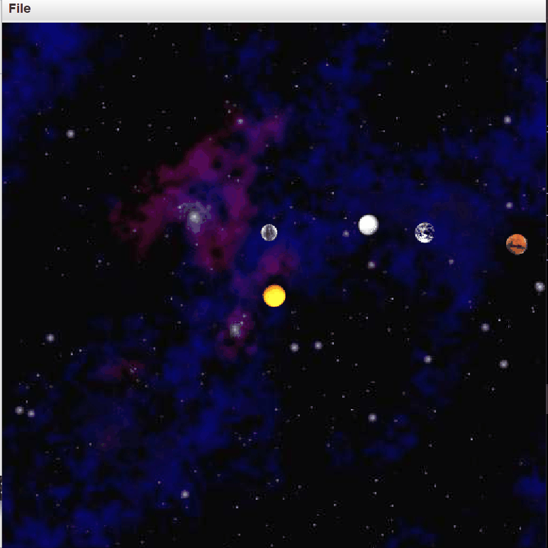
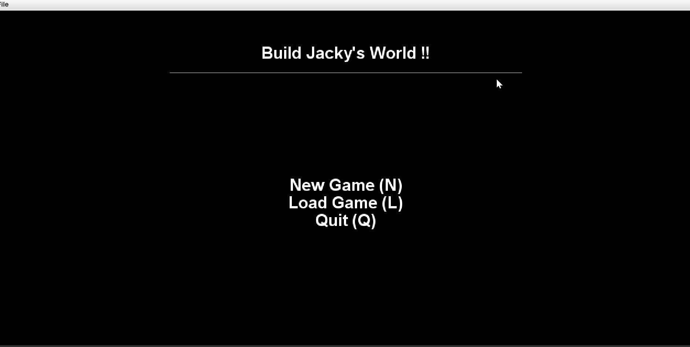
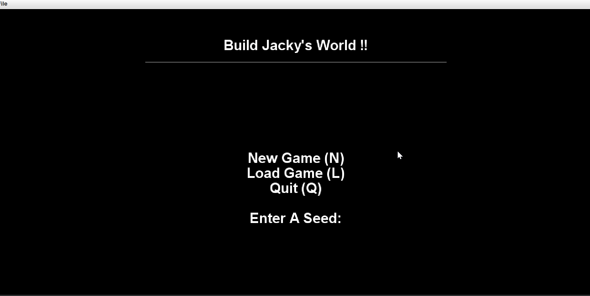
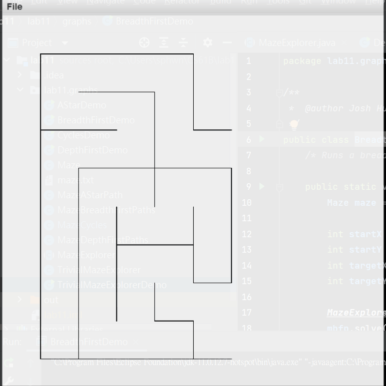
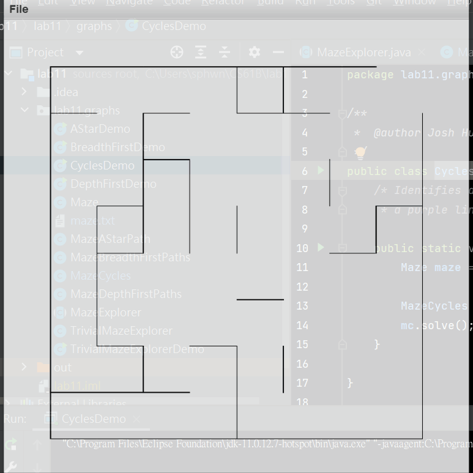
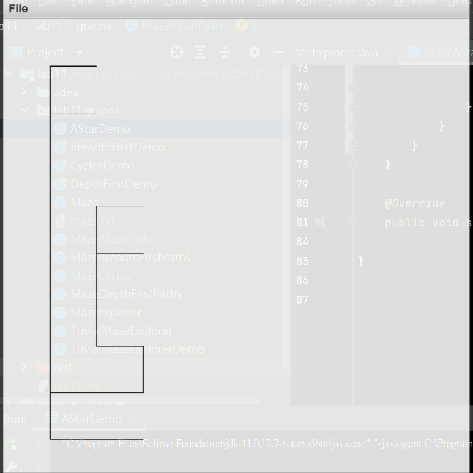

## Project: NBody Simulation

[Description](https://sp18.datastructur.es/materials/proj/proj0/proj0)  
[SourceCode](https://github.com/jacky0405/CS61B/tree/main/proj0)
## Project: Build Own World Game
(1) Key in a number to build a world

(2) After quit(Q) the game, you can reload it.
  
[Description](https://sp18.datastructur.es/materials/proj/proj2/proj2)  
[SourceCode](https://github.com/jacky0405/CS61B/tree/main/proj2/byog/Core) 
## Graph
Breadth-First Search

Depth-First Search & Cycle Check

A*  

[Description](https://sp18.datastructur.es/materials/lab/lab11/lab11)  
[SourceCode](https://github.com/jacky0405/CS61B/tree/main/lab11/lab11/graphs)
